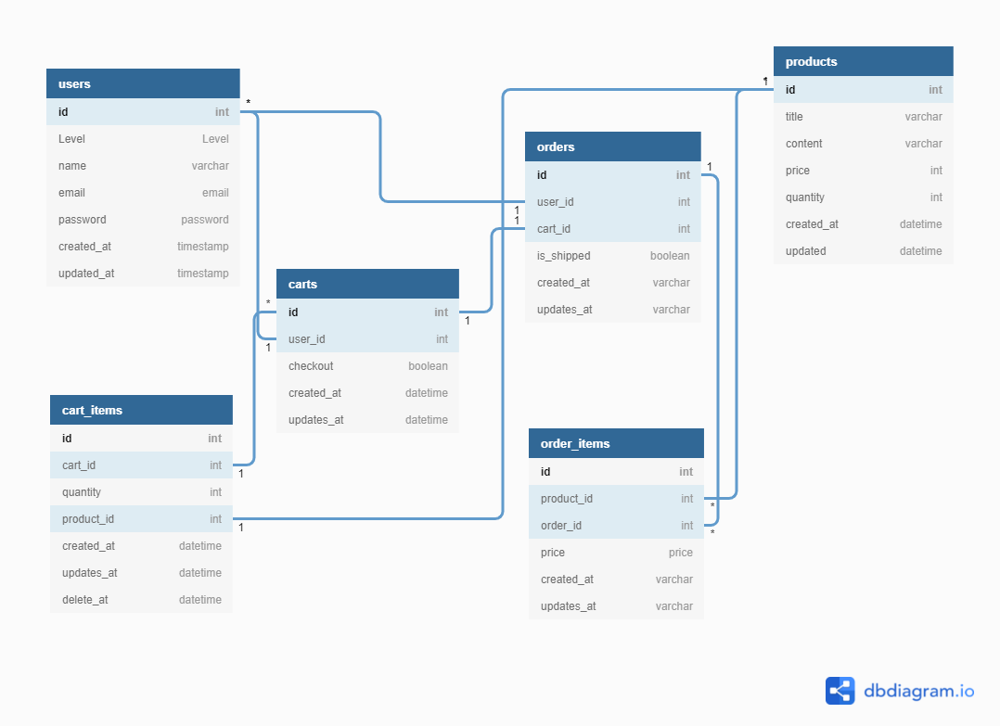

### 做出一個前台資料顯示 + 後台管理的網站。

#### 功能列表:

功能列表:

1. Notification 通知站內信

2. Queue 佇列排程

3. Redis 資料讀取緩衝

4. Observer 做資料監控自行調整

5. HTTP 串接短網址服務

6. File 檔案上傳

7. Error Exception 錯誤管理

8. Log 日誌紀錄

9. Excel 單表匯入與匯出

10. Excel 多表匯出與客製格式化

11. Controller 單元測試

12. Factory 產生假資料

13. 整合測試

#### Youtube DEMO

[Youtube Demo Link](https://youtu.be/ZmNn5XDHOxI) 

#### SQL架構

 
